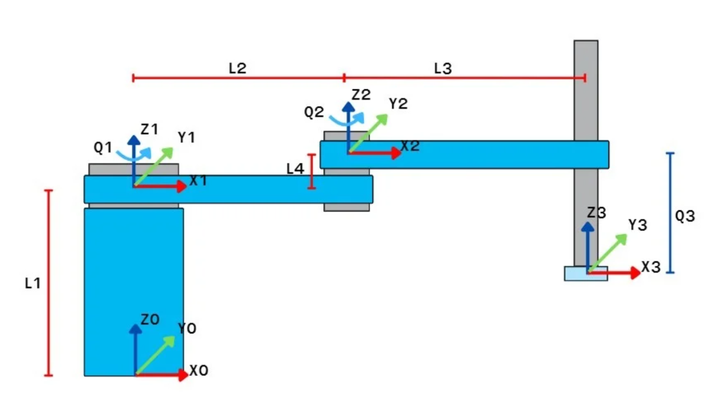

# ระบบควบคุมแขนกล SCARA 3DOF

**FRA333 Robot Kinematics**

รหัสนักศึกษา:
- 66340500045
- 66340500051

โปรเจกต์นี้พัฒนาระบบควบคุมแขนกล SCARA แบบ 3 องศาอิสระ (3 DOF) ด้วย Python โดยประยุกต์ใช้ Inverse Kinematics สำหรับคำนวณตำแหน่ง joints และสื่อสารกับ PLC Mitsubishi FX5U ผ่าน Modbus TCP ระบบมี GUI แบบโต้ตอบที่สามารถลากเมาส์เพื่อควบคุมตำแหน่งแขนกลแบบ real-time พร้อมแสดงผลการเคลื่อนที่และ workspace ของหุ่นยนต์

---

## สารบัญ

1. [วัตถุประสงค์](#1-วัตถุประสงค์)
2. [ขอบเขตของโปรเจกต์](#2-ขอบเขตของโปรเจกต์)
3. [ทฤษฎีที่เกี่ยวข้อง](#3-ทฤษฎีที่เกี่ยวข้อง)
4. [คำอธิบายระบบ](#4-คำอธิบายระบบ)
5. [สถาปัตยกรรมระบบ](#5-สถาปัตยกรรมระบบ)
6. [แผนภาพระบบ](#6-แผนภาพระบบ)
7. [วิธีการดำเนินงาน](#7-วิธีการดำเนินงาน)
8. [การใช้งาน](#8-การใช้งาน)

---

## 1. วัตถุประสงค์

- พัฒนาระบบควบคุมแขนกล SCARA 3DOF โดยใช้ Forward และ Inverse Kinematics
- ออกแบบระบบสื่อสารระหว่าง PC และ PLC ผ่าน Modbus TCP protocol
- สร้าง GUI แบบโต้ตอบสำหรับควบคุมตำแหน่งแขนกลด้วยการลากเมาส์
- ประยุกต์ใช้ Denavit-Hartenberg (DH) parameters ในการสร้างโมเดลหุ่นยนต์
- วิเคราะห์ workspace และ singularities ของแขนกล SCARA
- ทดสอบและตรวจสอบความถูกต้องของระบบผ่านการจำลองและการควบคุมจริง

---

## 2. ขอบเขตของโปรเจกต์

### ขอบเขตการศึกษา

- ศึกษาแขนกล SCARA แบบ 2R + 1P (2 Revolute joints + 1 Prismatic joint)
- ใช้ Modified Denavit-Hartenberg (MDH) Convention
- พัฒนาระบบด้วย Python และ Robotics Toolbox
- สื่อสารกับ PLC Mitsubishi FX5U ผ่าน Modbus TCP
- ควบคุม Stepper Motor ด้วย Pulse Train Output

### ข้อจำกัดของระบบ

**พารามิเตอร์หุ่นยนต์:**

| พารามิเตอร์ | สัญลักษณ์ | ค่า | หน่วย |
|------------|----------|-----|-------|
| ความยาว Link 1 | L1 | 130 | mm |
| ความยาว Link 2 | L2 | 115 | mm |
| ความยาว Link 3 | L3 | 130 | mm |
| Offset แกน Z | L4 | 14 | mm |

**ขอบเขตการเคลื่อนที่:**

- Joint 1 (J1): -90° ถึง +90°
- Joint 2 (J2): -90° ถึง +90°
- Z-axis: 0 mm ถึง -80 mm

**ข้อจำกัดของแรงควบคุม:**

- แรงควบคุมสูงสุดถูกจำกัดโดย Stepper Motor specifications
- อัตราการส่งคำสั่งจำกัดที่ 100ms (10 Hz) เพื่อป้องกันการส่งคำสั่งรัว ๆ

**ข้อจำกัดอื่น ๆ:**

- ระบบไม่คำนึงถึงแรงเสียดทานที่แกน joints (สำหรับการคำนวณ IK)
- ระบบคำนวณจากโมเดลที่สมมติว่าเป็นแบบ rigid body
- ไม่มีการป้อนกลับตำแหน่งจาก encoder (open-loop control)
- ใช้งานผ่าน Ethernet/LAN connection เท่านั้น

---

## 3. ทฤษฎีที่เกี่ยวข้อง

### 3.1 Denavit-Hartenberg (DH) Parameters

วิธีการ Denavit-Hartenberg เป็นวิธีมาตรฐานในการอธิบายการเชื่อมต่อของ links และ joints ในหุ่นยนต์ โดยใช้พารามิเตอร์ 4 ตัว:

- **α (alpha)**: มุมบิด (twist angle) ระหว่าง Z<sub>i-1</sub> และ Z<sub>i</sub>
- **a**: ระยะห่าง (link length) ระหว่าง Z<sub>i-1</sub> และ Z<sub>i</sub>
- **d**: ระยะ offset ตามแกน Z<sub>i</sub>
- **θ (theta)**: มุมหมุนรอบแกน Z<sub>i</sub>

**Modified DH Convention:**

Transformation matrix สำหรับแต่ละ joint:

```
T_i = Rot(Z, θ_i) × Trans(0, 0, d_i) × Trans(a_i, 0, 0) × Rot(X, α_i)
```

**DH Parameter Table สำหรับ SCARA 3DOF:**

| Joint i | α<sub>i-1</sub> | a<sub>i-1</sub> (mm) | d<sub>i</sub> (mm) | θ<sub>i</sub> | Type |
|---------|-----------------|----------------------|--------------------|---------------|------|
| 1 | 0° | 0 | 130 | θ₁* | R |
| 2 | 0° | 115 | 14 | θ₂* | R |
| 3 | 0° | 130 | d₃* | 0° | P |

*R = Revolute (หมุน), P = Prismatic (เลื่อน)*

*θ₁, θ₂, d₃ คือตัวแปรที่ควบคุมได้*

### 3.2 Forward Kinematics

Forward Kinematics (FK) ใช้สำหรับคำนวณตำแหน่งและทิศทางของ end-effector จากมุมของ joints

**สมการ Forward Kinematics:**

```
T₀³ = T₀¹ × T₁² × T₂³
```

**ตำแหน่ง End-effector:**

```
x = L2·cos(θ₁ + θ₂) + L3·cos(θ₁)
y = L2·sin(θ₁ + θ₂) + L3·sin(θ₁)
z = L1 + L4 + d₃
```

**Implementation:**

```python
# ใช้ Robotics Toolbox
T = robot.fkine([θ1, θ2, z])
position = T.t  # [x, y, z] ในพิกัด Cartesian
```

### 3.3 Inverse Kinematics

Inverse Kinematics (IK) ใช้สำหรับคำนวณมุมของ joints จากตำแหน่งที่ต้องการของ end-effector

**วิธีแก้ปัญหา IK:**

โปรเจกต์นี้ใช้ **Levenberg-Marquardt Algorithm** ซึ่งเป็น numerical iterative method:

1. กำหนด cost function:
   ```
   E(q) = ||f(q) - x_desired||²
   ```

2. คำนวณ Jacobian matrix:
   ```
   J = ∂f/∂q
   ```

3. Update ตัวแปร joints:
   ```
   Δq = -(J^T·J + λ·I)^(-1) · J^T · e
   q_new = q_old + Δq
   ```

4. ทำซ้ำจนกว่า error < threshold

**Implementation:**

```python
solution = robot.ikine_LM(
    target_SE3,           # ตำแหน่งเป้าหมาย
    q0=[0, 0, 0],        # ค่าเริ่มต้น
    mask=[1,1,1,0,0,0]   # ควบคุมเฉพาะตำแหน่ง (x,y,z)
)
```

### 3.4 Jacobian Matrix

Jacobian matrix แสดงความสัมพันธ์ระหว่างความเร็วของ joints กับความเร็วของ end-effector:

```
ẋ = J(q) · q̇
```

สำหรับ SCARA 3DOF:

```
J = [∂x/∂θ₁  ∂x/∂θ₂  ∂x/∂z]
    [∂y/∂θ₁  ∂y/∂θ₂  ∂y/∂z]
    [∂z/∂θ₁  ∂z/∂θ₂  ∂z/∂z]
```

**การใช้งาน:**

- คำนวณความเร็วของ end-effector
- ตรวจสอบ singularities (เมื่อ det(J) ≈ 0)
- ใช้ในการแก้ปัญหา IK

### 3.5 Workspace Analysis

**Workspace ของ SCARA:**

SCARA มี workspace เป็นรูปวงแหวน (annular):

```
r_min = |L2 - L3| = |115 - 130| = 15 mm
r_max = L2 + L3 = 115 + 130 = 245 mm
```

**การตรวจสอบ Workspace:**

```python
def is_in_workspace(x, y, z):
    r = sqrt(x² + y²)
    return (r_min ≤ r ≤ r_max) and (z_min ≤ z ≤ z_max)
```

### 3.6 Singularity

**Singularity Configuration:**

SCARA มี singularities เมื่อ:

1. **Elbow Singularity**: θ₂ = 0° หรือ ±180°
2. **Boundary Singularity**: ที่ขอบของ workspace (r = r_min หรือ r_max)

ใน singularity configuration:
- Jacobian matrix มี rank ไม่เต็ม (det(J) = 0)
- หุ่นยนต์สูญเสีย degree of freedom ในบางทิศทาง
- ไม่สามารถเคลื่อนที่ได้ในทิศทางบางทิศทาง

---

## 4. คำอธิบายระบบ

### 4.1 ภาพรวมของระบบ

ระบบควบคุมแขนกล SCARA 3DOF ประกอบด้วยส่วนหลัก 3 ส่วน:

1. **PC (Python Application)**
   - GUI สำหรับควบคุมและแสดงผล
   - คำนวณ Inverse Kinematics
   - จัดการ command queue และ debouncing
   - สื่อสารกับ PLC ผ่าน Modbus TCP

2. **PLC (Mitsubishi FX5U)**
   - รับคำสั่งจาก PC
   - สร้าง Pulse Train สำหรับควบคุม Stepper Motor
   - ควบคุม direction output

3. **Robot Arm (SCARA 3DOF)**
   - 2 Revolute joints (J1, J2)
   - 1 Prismatic joint (Z-axis)
   - ขับเคลื่อนด้วย 3 Stepper Motors

### 4.2 พารามิเตอร์ของระบบ

**พารามิเตอร์ทางกายภาพ:**

| พารามิเตอร์ | สัญลักษณ์ | ค่า | หน่วย |
|------------|----------|-----|-------|
| ความยาว Link 1 | L1 | 130 | mm |
| ความยาว Link 2 | L2 | 115 | mm |
| ความยาว Link 3 | L3 | 130 | mm |
| Offset Z | L4 | 14 | mm |

**พารามิเตอร์การควบคุม:**

| พารามิเตอร์ | ค่า | หน่วย |
|------------|-----|-------|
| Steps per Revolution | 400 | steps |
| Gear Ratio | 3.75 | : 1 |
| Debounce Interval | 100 | ms |
| Z-axis Resolution | 2.5 | μm/pulse |

### 4.3 State Variables

**ตัวแปรสถานะ:**

| State | สัญลักษณ์ | คำอธิบาย | หน่วย |
|-------|----------|---------|-------|
| Joint 1 Angle | θ₁ | มุมหมุนของแกน 1 | rad |
| Joint 2 Angle | θ₂ | มุมหมุนของแกน 2 | rad |
| Z Position | z | ตำแหน่งแกนเลื่อน | mm |
| X Position | x | ตำแหน่ง X ของ end-effector | mm |
| Y Position | y | ตำแหน่ง Y ของ end-effector | mm |

### 4.4 Coordinate Systems

**ระบบพิกัด:**

- **Base Frame (Frame 0)**: ติดกับฐานของหุ่นยนต์
- **Joint Frames**: แต่ละ joint มี frame ของตัวเอง
- **End-effector Frame**: ติดกับปลายแขนกล

**มุมอ้างอิง:**

- θ = 0°: แขนชี้ไปทาง +X
- θ = 90°: แขนชี้ไปทาง +Y
- Z = 0: ตำแหน่งสูงสุด
- Z = -80mm: ตำแหน่งต่ำสุด

---

## 5. สถาปัตยกรรมระบบ

### 5.1 Software Architecture

```
┌─────────────────────────────────────────────────────────┐
│                    GUI Layer                            │
│  - Tkinter Interface                                    │
│  - Mouse/Keyboard Input Handler                         │
│  - Real-time Visualization                              │
└────────────────┬────────────────────────────────────────┘
                 │
┌────────────────▼────────────────────────────────────────┐
│              Control Logic Layer                        │
│  - Workspace Validation                                 │
│  - Command Queue Management                             │
│  - Debouncing System                                    │
└────────────────┬────────────────────────────────────────┘
                 │
┌────────────────▼────────────────────────────────────────┐
│           Kinematics Calculation                        │
│  - Forward Kinematics (Robotics Toolbox)                │
│  - Inverse Kinematics (Levenberg-Marquardt)             │
│  - Jacobian Computation                                 │
└────────────────┬────────────────────────────────────────┘
                 │
┌────────────────▼────────────────────────────────────────┐
│          Communication Layer                            │
│  - Modbus TCP Client                                    │
│  - Register Mapping                                     │
│  - Error Handling & Reconnection                        │
└────────────────┬────────────────────────────────────────┘
                 │
┌────────────────▼────────────────────────────────────────┐
│              PLC (FX5U)                                 │
│  - Modbus TCP Server                                    │
│  - Pulse Train Generation                               │
│  - Motor Control Logic                                  │
└────────────────┬────────────────────────────────────────┘
                 │
┌────────────────▼────────────────────────────────────────┐
│           Physical System                               │
│  - 3x Stepper Motors                                    │
│  - SCARA Mechanical Structure                           │
└─────────────────────────────────────────────────────────┘
```

### 5.2 Thread Architecture

ระบบใช้ Multi-threading เพื่อให้การทำงานเป็น real-time:

**Thread 1: GUI Thread**
- รับ input จากผู้ใช้
- แสดงผลการเคลื่อนที่
- Update display ทุก 16ms (60 FPS)

**Thread 2: IK Worker**
- คำนวณ Inverse Kinematics แบบ asynchronous
- ประมวลผลคำสั่งจาก queue
- ส่งผลลัพธ์ไปยัง scheduler

**Thread 3: Command Scheduler**
- Debouncing (100ms interval)
- จัดการ command queue
- ป้องกันการส่งคำสั่งรัว ๆ

**Thread 4: PLC Worker**
- สื่อสารกับ PLC
- Auto reconnection
- อ่านค่า feedback (ถ้ามี)

---

## 6. แผนภาพระบบ

### 6.1 Control Flow Diagram

```
┌────────────────────┐
│   User Input       │
│ • Mouse Drag       │
│ • Scroll Wheel     │
│ • Manual Entry     │
└─────────┬──────────┘
          │
          ▼
┌────────────────────┐
│  Workspace Check   │
│  r_min ≤ r ≤ r_max │
│  z_min ≤ z ≤ z_max │
└─────────┬──────────┘
          │
          ▼
┌────────────────────┐
│  Inverse Kinematics│
│  (Levenberg-       │
│   Marquardt)       │
└─────────┬──────────┘
          │
          ▼
┌────────────────────┐
│  Joint Clamping    │
│  Apply Limits      │
└─────────┬──────────┘
          │
          ▼
┌────────────────────┐
│  Angle→Pulse       │
│  Conversion        │
└─────────┬──────────┘
          │
          ▼
┌────────────────────┐
│  Command Queue     │
│  Debouncing        │
│  (100ms)           │
└─────────┬──────────┘
          │
          ▼
┌────────────────────┐
│  Modbus TCP        │
│  Write Registers   │
└─────────┬──────────┘
          │
          ▼
┌────────────────────┐
│  PLC Control       │
│  Pulse Generation  │
└─────────┬──────────┘
          │
          ▼
┌────────────────────┐
│  Robot Motion      │
└────────────────────┘
```

### 6.2 Communication Protocol

**Modbus TCP Register Map:**

| Register | Bit | ข้อมูล | ช่วงค่า | คำอธิบาย |
|----------|-----|--------|---------|----------|
| 0 | 16 | J1 Pulses | 0-750 | จำนวน pulse แกน 1 |
| 1 | 1 | J1 Direction | 0-1 | ทิศทาง (0=CW, 1=CCW) |
| 2 | 16 | J2 Pulses | 0-750 | จำนวน pulse แกน 2 |
| 3 | 1 | J2 Direction | 0-1 | ทิศทาง (0=CW, 1=CCW) |
| 4 | 16 | Z Pulses | 0-8000 | จำนวน pulse แกน Z |
| 5 | 1 | Z Direction | 0-1 | ทิศทาง (0=Up, 1=Down) |

---

## 7. วิธีการดำเนินงาน

### 7.1 Kinematics Implementation

**Step 1: สร้าง Robot Model**

```python
import roboticstoolbox as rtb

# กำหนดค่าพารามิเตอร์
L1 = 0.13  # 130 mm
L2 = 0.115 # 115 mm
L3 = 0.13  # 130 mm
L4 = 0.014 # 14 mm

# สร้าง robot model ด้วย Modified DH
robot = rtb.DHRobot([
    rtb.RevoluteMDH(a=0,  alpha=0, d=L1),
    rtb.RevoluteMDH(a=L2, alpha=0, d=L4),
    rtb.PrismaticMDH(a=L3, alpha=0, theta=0)
], name="SCARA_3DOF")
```

**Step 2: Forward Kinematics**

```python
def forward_kinematics(q1, q2, z):
    """
    คำนวณตำแหน่ง end-effector จากมุม joints
    """
    T = robot.fkine([q1, q2, z])
    return T.t  # [x, y, z]
```

**Step 3: Inverse Kinematics**

```python
def inverse_kinematics(x, y, z):
    """
    คำนวณมุม joints จากตำแหน่งเป้าหมาย
    """
    # สร้าง target transformation
    T_target = SE3(x, y, z)
    
    # แก้ IK ด้วย Levenberg-Marquardt
    sol = robot.ikine_LM(
        T_target,
        q0=[0, 0, 0],
        mask=[1, 1, 1, 0, 0, 0]
    )
    
    if sol.success:
        return sol.q  # [θ1, θ2, z]
    else:
        return None
```

### 7.2 Communication Implementation

**Step 1: Angle to Pulse Conversion**

```python
def angle_to_pulses(angle_rad):
    """
    แปลงมุม (radians) เป็น pulse count
    """
    STEPS_PER_REV = 400
    GEAR_RATIO = 3.75
    
    angle_deg = np.degrees(angle_rad)
    total_pulses = (angle_deg / 360) * STEPS_PER_REV * GEAR_RATIO
    
    pulse_count = int(abs(total_pulses))
    direction_flag = 1 if total_pulses < 0 else 0
    
    return pulse_count, direction_flag
```

**Step 2: Z Position Mapping**

```python
def z_to_pulses(z_mm):
    """
    แปลงตำแหน่ง Z (mm) เป็น pulse count
    """
    Z_MIN = -80
    Z_MAX = 0
    Z_PULSE_MAX = 32000
    
    normalized = (z_mm - Z_MAX) / (Z_MIN - Z_MAX)
    pulses = int(normalized * Z_PULSE_MAX)
    direction_flag = 1 if z_mm < 0 else 0
    
    return pulses, direction_flag
```

**Step 3: Modbus Communication**

```python
from pymodbus.client import ModbusTcpClient

def send_to_plc(q1, q2, z):
    """
    ส่งคำสั่งไปยัง PLC
    """
    # แปลงค่า
    j1_pulse, j1_dir = angle_to_pulses(q1)
    j2_pulse, j2_dir = angle_to_pulses(q2)
    z_pulse, z_dir = z_to_pulses(z)
    
    # เตรียม registers
    registers = [
        j1_pulse, j1_dir,
        j2_pulse, j2_dir,
        z_pulse, z_dir
    ]
    
    # เขียนไปยัง PLC
    client.write_registers(0, registers, unit=1)
```

### 7.3 Debouncing System

```python
class CommandScheduler:
    def __init__(self, interval=0.1):
        self.interval = interval
        self.last_time = 0
        self.pending = None
    
    def schedule(self, command):
        """เพิ่มคำสั่งใหม่"""
        self.pending = command
    
    def process(self):
        """ประมวลผลคำสั่งที่รอ"""
        if self.pending is None:
            return
        
        now = time.time()
        if (now - self.last_time) >= self.interval:
            send_to_plc(*self.pending)
            self.last_time = now
            self.pending = None
```

---

## 8. การใช้งาน

### 8.1 ความต้องการของระบบ

**Software:**

```bash
Python 3.8 or higher
pip (Python package manager)
```

**Python Libraries:**

```bash
pip install roboticstoolbox-python
pip install spatialmath-python
pip install pymodbus
pip install matplotlib
pip install tkinter
```

**Hardware:**

- PC with Ethernet port
- Mitsubishi PLC FX5U
- 3x Stepper Motors
- SCARA Robot Structure
- Ethernet Cable


กรอกค่าพิกัด: ใส่ค่า X, Y, Z ที่ต้องการ (หน่วย mm)
กดปุ่ม "Go": ส่งคำสั่งให้แขนกลเคลื่อนที่
กดปุ่ม "Home": กลับไปตำแหน่งเริ่มต้น (0, 0, 0)
กดปุ่ม "Set Current": ตั้งค่าตำแหน่งปัจจุบันเป็นเป้าหมาย


